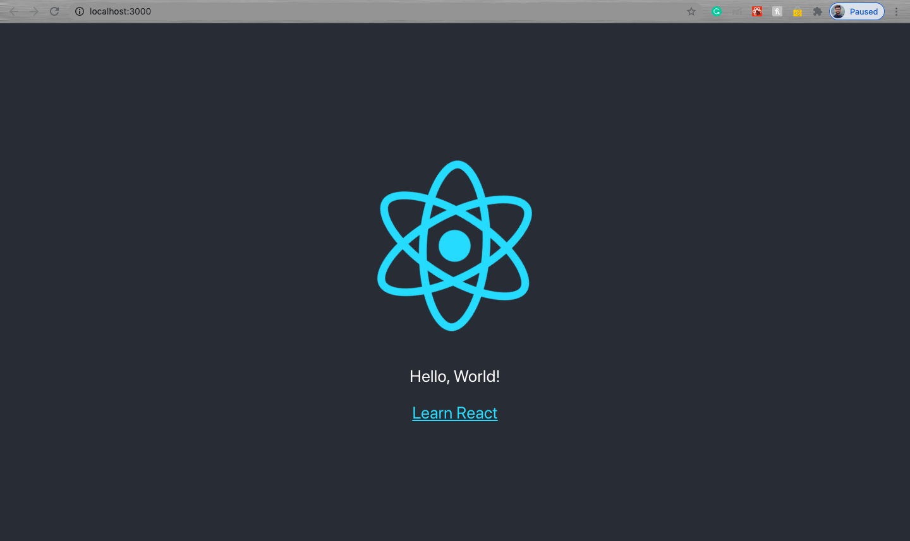

# Roadmap-To-React
This repository contains step-by-step tutorials for getting started with React.js
=======
Step 1: Create a directory first and move to that directory. I have named my directory as React.

Step 2: Open up your favourite editor. I have used WebStorm by JetBrains.

Step 3: Open up the editor terminal or your device terminal. If you are opening your device terminal move to this directory that you have created.

Step 4: Run the following command npx create-react-app "name of your project"

For example: npx create-react-app learning-react

Note: The name of the project must be in lowercase.

Step 5: Navigate to folder that yu have created by running cd learning-react

Step 6: Now we are done, and we have successfully created our first project.

Step 7: Now, it's time to run the project.

Step 8: Run the command: npm start and here we go....

### Adding our first Functional Component

Adding one directory to the src folder named as components, we'll keep all the components in this file only. 

Now create a js file which will be Greet.js and our first functional component also.

The simplest way to define a component is to write a JavaScript function. A valid React component because it accepts a single “props” (which stands for properties) object argument with data and returns a React element. We call such components “function components” because they are literally JavaScript functions.